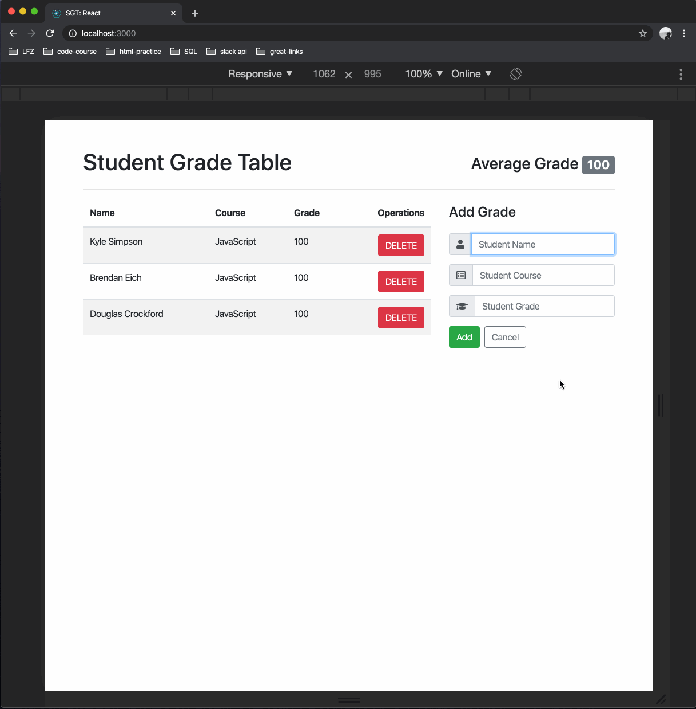

# sgt-react

A web application written in React with an Express server, and styled with bootstrap, to allow the user to keep track of and update student grades.

## Features

- [User can view all grades.]
- [User can view the average grade.]
- [User can add a grade.]
- [User can delete a grade.]
- [User can update a grade.]

## Preview

