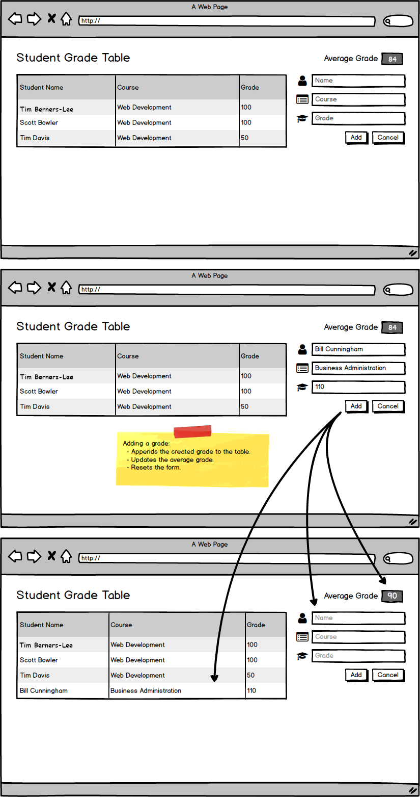
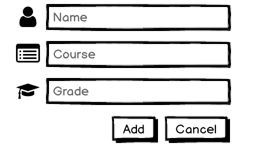

## User can add a grade.

### Before You Begin

Be sure to check out the `master` branch and pull any merged changes from `origin` on GitHub. Then check out a new branch named `add-a-grade`. Make a commit after completing each implementation step.

### 💰 Motivation

Teachers at the school would like to record new student grades without having to give them to the database administrator.

### 🖼 Wireframe

### ⚙️ Updated Components

#### `App`

- Now has a method for `POST`ing a new grade to the server before adding it to `state`.
- Now renders a `GradeForm` component along with the `Header` and `GradeTable`.

### ⚙️ New Components

#### `GradeForm`

- Lets the user enter and submit a new grade.
- Lets the user reset the form with a "Cancel" button.
- Passes the user's submission to the submit callback it receives via `props`.

### 🏗 Implementation

- Add a method to `App` that can `POST` a new grade to the server before updating state.
- Define a `GradeForm` component that has inputs and buttons to submit a new grade.
  - `GradeForm` should have an initial state for empty fields.
  - Change handler(s) for when the user types in the fields.
  - A submit handler for when the user submits the form. This submit handler should pass a new grade to a callback received via `props`.
  - A reset handler to reset state if the user cancels their entry.
- Update `App`'s render method to also render the `GradeForm` and pass its method for adding a grade via `props`.

### Submitting Your Work

When this feature is complete, be sure to push all new commits to `origin add-a-grade`. Then open a Pull Request on your Fork of `sgt-react` to merge `add-a-grade` into `master`.

Get an instructor to **Approve** your Pull Request before merging it into `master` and moving to the next feature.  **Be sure to include a screenshot or gif of your app in the Pull Request comment.** After you get approval, merge your feature branch.
