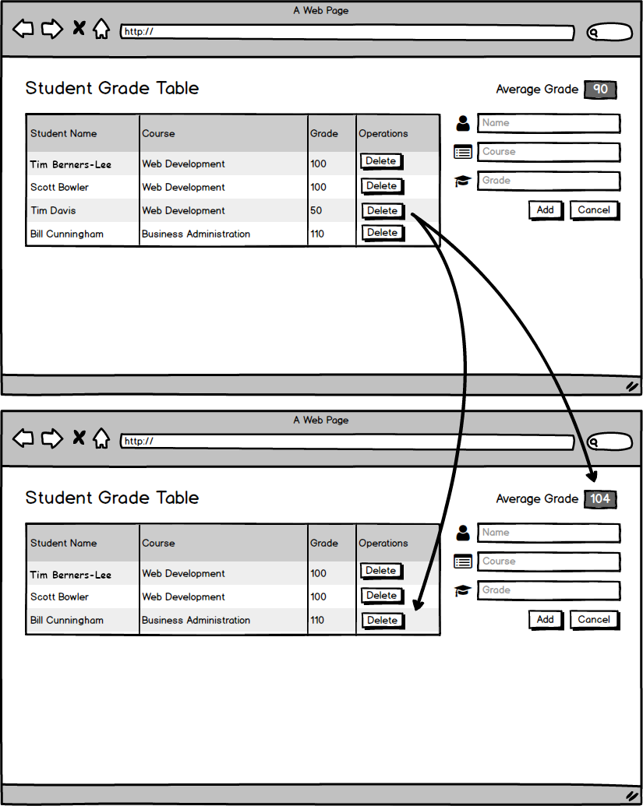

## User can delete a grade.

### Before You Begin

Be sure to check out the `master` branch and pull any merged changes from `origin` on GitHub. Then check out a new branch named `delete-a-grade`. Make a commit after completing each implementation step.

### 💰 Motivation

Teachers at the school would like to delete the grades of students that get kicked out of class.

### 🖼 Wireframe

### ⚙️ Updated Components

#### `App`

- Now has a method for sending a `DELETE` request to the server before removing the deleted grade from `state`.
- Now passes its method for removing grades to the `GradeTable`.

#### `GradeTable`

- Now receives a grade removal callback via props.
- Now passes its grade removal callback to each `Grade` it renders.

#### `Grade`

- Now receives a callback for deleting a grade from `GradeTable`.
- Now displays a delete button to the user.

#### `Grade`

### 🏗 Implementation

- Define a method on `App` to send a `DELETE` request to the server, given a grade's `id`; then 😉 remove the identified grade from `state`.
- Update `App`'s render method to pass the removal method to `GradeTable`.
- Update `GradeTable` to pass a removal method to each `Grade` that it renders.
- Update `Grade` to display a delete button.

### Submitting Your Work

When this feature is complete, be sure to push all new commits to `origin delete-a-grade`. Then open a Pull Request on your Fork of `sgt-react` to merge `delete-a-grade` into `master`.

Get an instructor to **Approve** your Pull Request before merging it into `master` and moving to the next feature.  **Be sure to include a screenshot or gif of your app in the Pull Request comment.** After you get approval, merge your feature branch.
