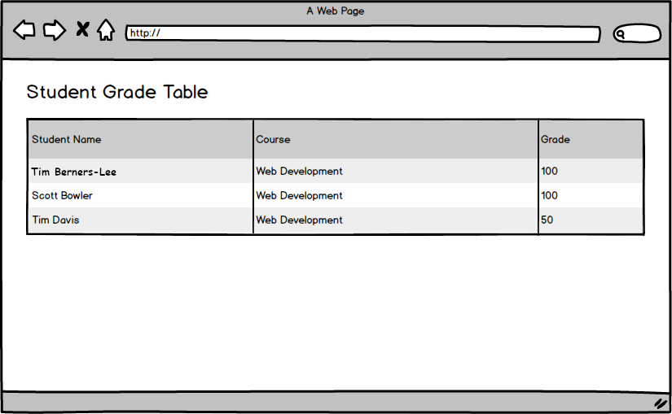
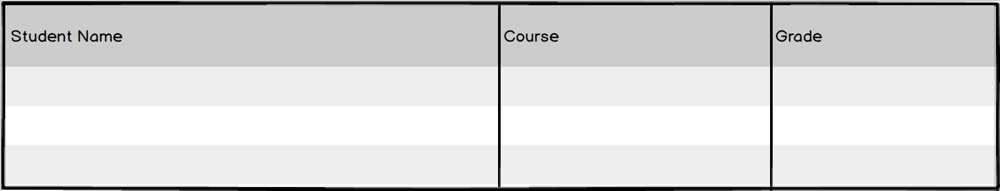
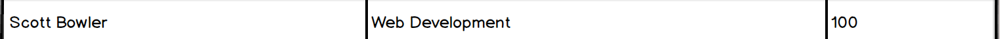

## User can view all grades.

### Before You Begin

Be sure to check out the `master` branch and pull any merged changes from `origin` on GitHub. Then check out a new branch named `view-all-grades`. Make a commit after completing each implementation step.

### 💰 Motivation

A school has a list of student grades on a server and the teachers would like a user-friendly way to view them.

### 🖼 Wireframe

### ⚙️ New Components

#### `Header`

- Displays a title at the top of the user interface.

#### `GradeTable`

- Displays a list of grades, if there are any.
- If there are no grades, a message reading "No grades recorded" is displayed.
- Receives all grades from `App` via `props`.

#### `Grade`

- Displays a single row in the `<GradeTable/>`.
- Receives a single grade from `GradeTable` via `props`.

### 🏗 Implementation

- Give the `App` component an initial state for `grades` that is an empty `Array`.
- Define a `Header` Component that shows the title "Student Grade Table" and include it in `App`'s `render` method.
- [After the `App` component has mounted](https://reactjs.org/docs/react-component.html#componentdidmount), send a `GET` request to retrieve all of the JSON grades on the server and update `App`'s state. You can check the state of the `App` component in many ways, including:
  - [React Dev Tools](https://chrome.google.com/webstore/detail/react-developer-tools/fmkadmapgofadopljbjfkapdkoienihi?hl=en)
  - Console log in [`componentDidUpdate()`](https://reactjs.org/docs/react-component.html#componentdidupdate)
  - Console log in the callback for [`setState()`](https://reactjs.org/docs/react-component.html#setstate)
- Define a `Grade` component that takes a single `grade` via props and renders a [Bootstrap-styled](https://getbootstrap.com/docs/4.3/content/tables/) table row.
- Define a `GradeTable` component that takes all of the `grades` of via props and renders a [Bootstrap-styled](https://getbootstrap.com/docs/4.3/content/tables/) table.
- Modify `App`'s `render` method to include `GradeTable`, passing its `grades` state as a prop.

### Submitting Your Work

When this feature is complete, be sure to push all new commits to `origin view-all-grades`. Then open a Pull Request on your Fork of `sgt-react` to merge `view-all-grades` into `master`.

Get an instructor to **Approve** your Pull Request before merging it into `master` and moving to the next feature.  **Be sure to include a screenshot or gif of your app in the Pull Request comment.** After you get approval, merge your feature branch.
