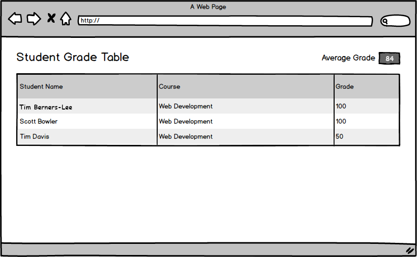

## User can view the average grade.

### Before You Begin

Be sure to check out the `master` branch and pull any merged changes from `origin` on GitHub. Then check out a new branch named `view-average-grade`. Make a commit after completing each implementation step.

### Motivation

Teachers at the school like to know how their students are performing in aggregate, so the app should compute the average grade for them.

### Wireframe

### Updated Components

#### `App`

- Now has a method that gets the average score of all grades in `state`.

#### `Header`

- Now receives the average grade via props.
- Now renders the average grade along with the page title.

### Implementation

- Add a method to `App` named `getAverageGrade` that reads all `grades` from state and returns a `Number` for the average grade (rounded up to an integer).
- Modify `App`'s render method to pass the average grade to `Header` via props.
- Modify `Header` to also render a [Bootstrap-styled](https://getbootstrap.com/docs/4.3/components/badge/) badge with a label for the average grade.

### Submitting Your Work

When this feature is complete, be sure to push all new commits to `origin view-average-grade`. Then open a Pull Request on your Fork of `sgt-react` to merge `view-average-grade` into `master`.

Get an instructor to **Approve** your Pull Request before merging it into `master` and moving to the next feature.  **Be sure to include a screenshot or gif of your app in the Pull Request comment.** After you get approval, merge your feature branch.
